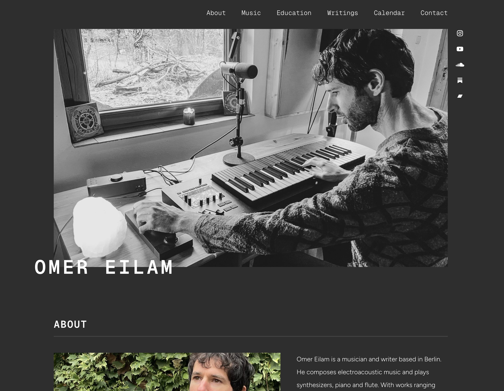
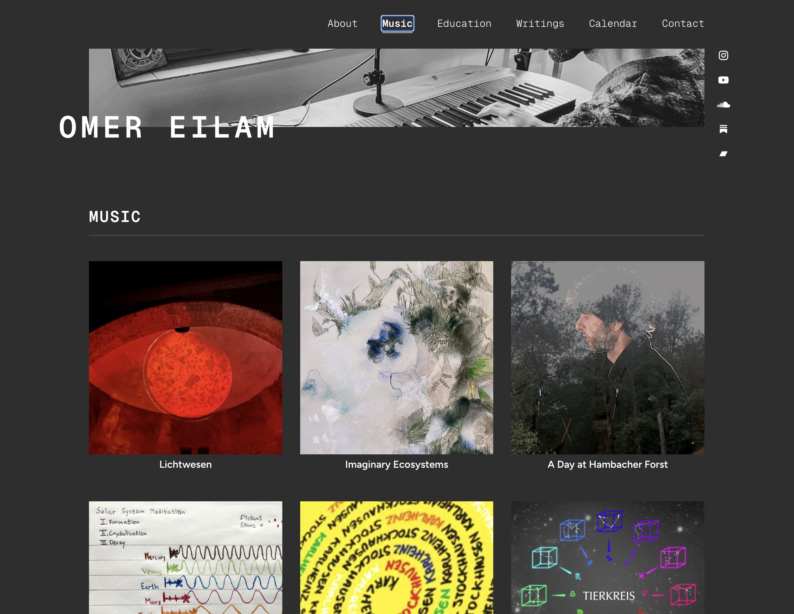
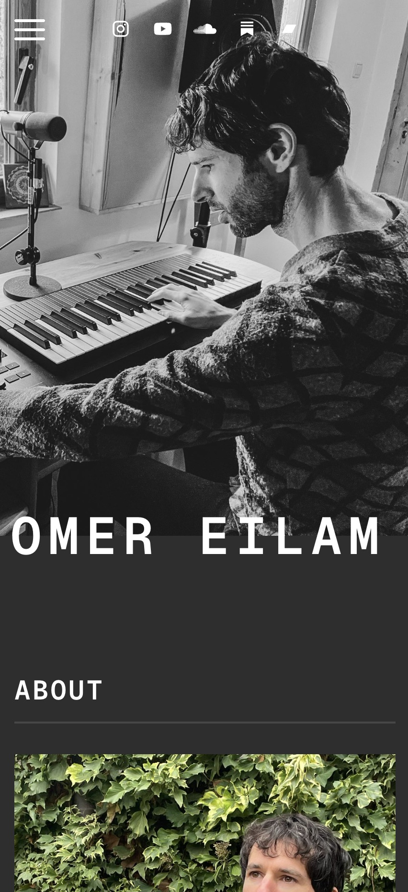
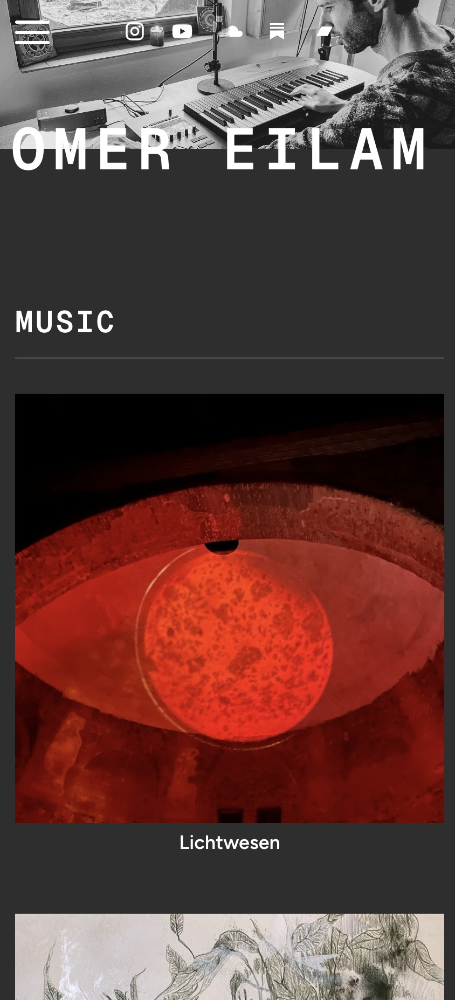

# Omer Eilam – Portfolio Website

A portfolio website for Berlin-based composer and musician **Omer Eilam**, built as a freelance project.

## Screenshots

## Tech Stack

- **React** + **TypeScript** (Vite)
- **MUI (Material UI)** – component library, custom theming
- **DOMPurify** – HTML sanitization
- **dayjs** – date formatting
- **React Router** – client-side routing
- **Framer Motion** – animations and transitions

## Features

- Light/dark mode with a custom MUI theme (Geist Mono + Figtree typefaces)
- Typewriter animation effect via custom `useTypewriter` hook
- Fullscreen image gallery with keyboard-friendly modal navigation (previous/next)
- Secure HTML rendering using DOMPurify with automatic `rel="noopener noreferrer"` injection on all external links
- Sections: Home, Music, Writings, Calendar, Education, About, Contact
- Substack and MailerLite embed integrations

## Status

Deployed and live at https://www.omereilam.com
